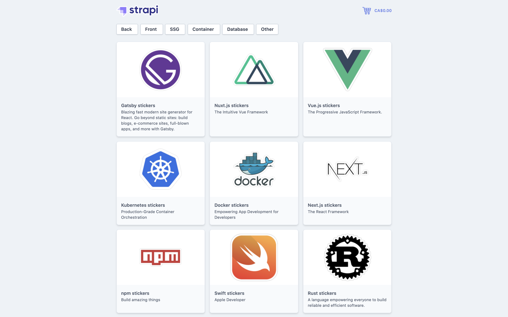

# Strapi Starter Next.js E-commerce

Next.js starter for creating a simple e-commerce website with Strapi.



This starter allows you to try Strapi with Next.js with the example of a simple e-commerce website where you can buy dev stickers. It is fully customizable and due to the fact that it is open source, fully open to contributions. So do not hesitate to add new features and report bugs!

## Features

- 1 Component
- 2 Collection types: Product, Category
- 27 Created products
- 6 Created categories
- Permissions set to `true` for product and category
- Responsive design using Tailwind css
- Slug system
- Publication system (draft & published)
- Role based access controls
- Payments handled with Snipcart

This starter is using [Snipcart](https://snipcart.com/) which allows you setup a shopping cart on any website. They wrote a [tutorial](https://snipcart.com/blog/strapi-nuxt-ecommerce-tutorial) teaching you how to create this website but selling cupcakes!

Payment will not work on localhost, we are redirecting you to this [tutorial](https://snipcart.com/blog/develop-a-snipcart-powered-website-locally-using-ngrok) if you want to test payment locally.

## Getting started

The easiest way to try this starter is to run it locally on your computer.

First, you'll need to create your own copy of this starter. You can do so by clicking [the "Use this template" button](https://github.com/strapi/strapi-starter-next-ecommerce/generate) on GitHub, and filling the [form](https://docs.github.com/en/github/creating-cloning-and-archiving-repositories/creating-a-repository-from-a-template).

### Backend

Create a Strapi project named `backend` using the [e-commerce template](https://github.com/strapi/strapi-template-ecommerce):

```
# Using Yarn
yarn create strapi-app backend --template https://github.com/strapi/strapi-template-ecommerce

# Or using NPM
npx create-strapi-app backend --template https://github.com/strapi/strapi-template-ecommerce
```

The Strapi server will automatically start and import sample seed data.

### Frontend

Leave the Strapi backend running in the background. Open another terminal tab, and make sure you're in the `frontend` directory:

```bash
cd frontend
```

Then install dependencies and start the server:

```bash
# Using yarn
yarn install
yarn develop

# Using npm
npm install
npm run develop
```

The Next.js server will run here => [http://localhost:3000](http://localhost:3000)

Enjoy this starter!
